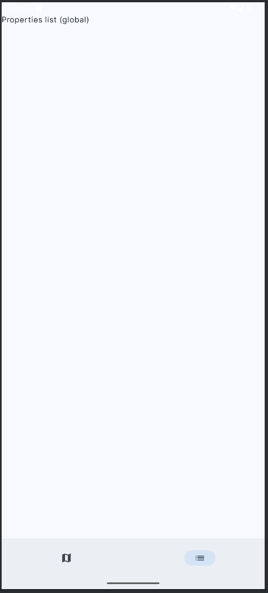
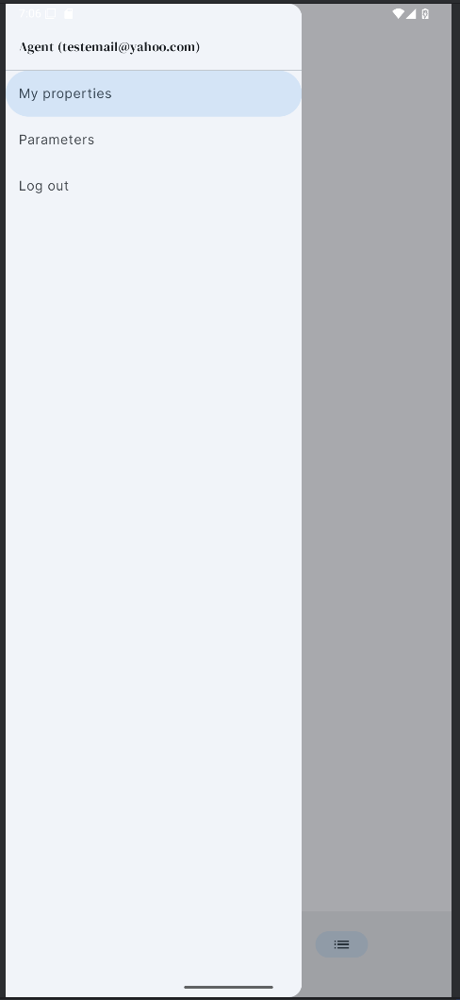

# 🏠 **RealEstateManager**
**RealEstateManager** is a modern Android application aimed at helping real estate agents manage exceptional property listings from their mobile device. Built to support a digital transformation for a prestigious New York agency, the app allows agents to browse, add, edit, and geolocate real estate properties even in offline mode.
This project is developed using modern Android architecture principles, with a focus on local data persistence, modular code, and responsive design. It evolves from a legacy intern prototype and will be gradually refactored and extended.

## 📚 **SUMMARY**
- [✅ LAST MAJOR UPDATES](#-last-major-updates-see-updatesmd-for-details)
- [❌ NEXT UPDATES](#-next-updates)
- [📋 Features](#-features)
- [🛠️ Tech Stack](#️-tech-stack)
- [🚀 How to Use](#-how-to-use)
- [📸 Screenshots](#-screenshots)
- [🤝 Contributions](#-contributions)

## ✅ **LAST MAJOR UPDATES (see [UPDATES.md](./UPDATES.md) for details)**

   - 🎨 Significant UI improvements have been made to enhance overall quality, consistency, and user experience.
   - 🗺️ Static maps are now fully supported offline and online instead of being stored as local-only URIs.
   - 🗄️ Added a dedicated Room entity for static maps with DAO and offline repository linked to properties.
   - 🔁 Static maps can be created, updated, and deleted completely offline and synchronized later.
   - ☁️ Implemented a Firebase Firestore repository to store static map metadata.
   - 📦 Integrated Firebase Storage to upload and download static map images across devices.
   - 🔄 Added upload and download sync managers to handle bidirectional synchronization between Room and Firebase.
   - 📱 Static maps are correctly restored when properties are downloaded on another device.
   - 🧩 Integrated static map repositories and sync managers into Dependency Injection (Hilt + AppContainer).
   - 🛡️ Added Firestore security rules to protect static maps based on authenticated user ownership.

## ❌ **NEXT UPDATES**

   - ⚠️ Implement backend logic for Forgot Password and Contact page.
   - Implemented responsive design for tablet.
   - 🔔 Notification on property creation.

## 📋 **Features**

   - 🏠 **Property Listings** :

      - ✅ **DONE** Create/edit property listings.
      - ✅ **DONE** View detail and photos of each property.
      - ✅ **DONE** Add status (available / sold).
      - ✅ **DONE** Add real estate agent assigned to each listing.
   
   - 📍 **Geolocation** :

      - ✅ **DONE** Auto-map property using Static Maps API.
      - ✅ **DONE** Display pins of nearby listings on a map.
      - ✅ **DONE** Retrieve and display user current location.
      - ✅ **DONE** Generate and store static map previews linked to properties.
      - ✅ **DONE** Static map images persist offline and are restored after synchronization.

   - 🔐 **User Authentication with Firebase** :

      - ✅ **DONE** Account creation and login exclusively online using Firebase Authentication.
      - ✅ **DONE** User's profile (ID, email, agent name), once authenticated, is cached locally in Room.
      - ✅ **DONE** Offline usage supported (if already logged in).

   - 🔁 **Global Data Sync** :

      - ✅ **DONE** Full sync of all entities: Users, Properties, Photos, POIs, Cross-References.
      - ✅ **DONE** One-way sync from local to Firebase (upload).
      - ✅ **DONE** One-way sync from Firebase to local (download).
      - ✅ **DONE**  Entity-specific managers for modular synchronization logic.
      - ✅ **DONE** Conflict resolution (e.g. field-level merge or overwrite strategies)
      - ✅ **DONE** Background sync using WorkManager + SyncWorker, enabled via AppContainerProvider.
      - ✅ **DONE** Full sync of Static Maps (metadata + image files).
      - ✅ **DONE** Offline-first synchronization for static maps using timestamp-based conflict resolution.

   - 📷 **Media Management** :

      - ✅ **DONE** Take or select photos from gallery.
      - ✅ **DONE** Add multiple images per listing.
      - ✅ **DONE** Downloads images from Firebase Storage and saves them locally on device during sync.
      - ✅ **DONE** Static map images are uploaded to and downloaded from Firebase Storage.
      - ✅ **DONE** Local caching of static map images for offline access.

   - 🔍 **Search** :

      - ✅ **DONE** Multi-criteria search (surface, price, type, POI, dates, sold status).
      - ✅ **DONE** Sort and filter property results.

   - 💾 **Offline Mode** :

      - ✅ **DONE** Offline access to all data (users, properties, photos, POIs, links)
      - ✅ **DONE** Full app usability offline (read/write locally, queue for sync).
      - ✅ **DONE** Changes made offline are queued for upload on next connectivity.
      - ✅ **DONE** Static maps fully supported offline (create, update, delete).
      - ✅ **DONE** Static map changes are queued and synchronized when connectivity is restored.

   - ☁️ **Online mode with Firebase Firestore**

      - ✅ **DONE** Upload and download of user and property data with Firebase Firestore.
      - ✅ **DONE** SyncManager to orchestrate entity-level sync logic.
      - ✅ **DONE** Upload/download of associated entities: photos, POIs, and cross-links.
      - ✅ **DONE** Integrated Firebase Storage for image file handling; only metadata is stored in Firestore while files are uploaded to Storage.
      - ✅ **DONE** Static map metadata stored in Firestore with ownership-based security rules.
      - ✅ **DONE** Static map images stored in Firebase Storage and linked via Firestore.

   - 📡 **Interoperability** :

      - ✅ **DONE** Exposed Room database via a read-only ContentProvider.
      - ✅ **DONE** Supports standard URI-based queries from external components or apps.
      - ✅ **DONE** Grants permission-controlled access (read-only) to data tables: properties, photos, users, POIs, and cross-links.

   - 🧠 **Utilities** :

      - ✅ **DONE** Convert dollar to euro.
      - ✅ **DONE** Convert euro to dollar.
      - ✅ **DONE** Get today's date (format to be improved).
      - ✅ **DONE** Reliable internet check using NetworkMonitor (supports API 21+ with fallbacks).
      - ✅ **DONE** Add unit and integration tests.

   - 🧭 **Navigation** :

      - 🟩 **IN PROGRESS** Navigation between list and detail.
      - ✅ **DONE** Setting up core navigation components:
        - Implementing a central NavHost in the main activity.
        - Defining the NavGraph with all destinations and actions.
        - Using a single NavController to manage navigation events.
      - ❌ **NOT IMPLEMENTED** Two-pane mode support for tablets.

   - 🎨 **Modern and Fluid Interface**:

      - 🟩 **IN PROGRESS** Follows Material Design 3 guidelines.
      - 🟩 **IN PROGRESS** Smooth transitions with Navigation Component.
      - 🟩 **IN PROGRESS** Responsive layout with adaptive UI.

      - **TopBar**:
         - 🟩 **IN PROGRESS** Display application title and possible future actions.

      - **Light/Dark Mode**:
         - ✅ **DONE** Supports light/dark mode.

      - **Custom theme**:
         - ✅ **DONE** Implemented custom colors and shapes.
         - ✅ **DONE** Implemented custom Google Fonts.

   - 🛠️ **Preferences & Settings** :

      - ✅ **DONE** Change application language (English 🇺🇸 / French 🇫🇷).
      - ✅ **DONE** Change display currency (USD 💵 / EUR 💶).
      - ✅ **DONE** Prices are dynamically converted based on selected currency (stored in dollars).
      - ✅ **DONE** Strings and layouts automatically adapt to selected language.
      - ✅ **DONE** Real-time UI updates without app restart when changing language or currency.

   - 🔄 **Real-time status management**:

      - ✅ **DONE** Use of StateFlow for UI state handling.
      - ✅ **DONE** ViewModel for lifecycle-aware logic.
      - ✅ **DONE** Coroutines for async data operations.

   - 🧠 **Architecture & Code Structure**:

      - ✅ **DONE** Refactored legacy Java into clean MVVM structure.
      - ✅ **DONE** Modularized repositories, DAOs, entities, and mappers with separation of concerns.
      - ✅ **DONE** Migrated dependency injection from manual AppContainer to Dagger Hilt.
      - ✅ **DONE** Static Map entity follows the same clean architecture pattern as Photos (Room ↔ Repository ↔ Sync ↔ Firebase).
      - ✅ **DONE** Dedicated upload and download managers for static map synchronization.

   - 🚀 **Performance and responsiveness**:
   
      - 🟩 **IN PROGRESS** Optimize UI scrolling and animations.

   - 🧪 **Testing & Quality Assurance** :

      - ✅ **DONE** Unit test for dollar to euro conversion.
      - ✅ **DONE** Unit test for euro to dollar conversion.
      - ✅ **DONE** Unit test for date formatting.
      - ❌ **NOT IMPLEMENTED** Integration test for network availability.
      - ✅ **DONE** Unit test for Models/Entities/OnlineEntities mappers.
      - ✅ **DONE** DAO tests using instrumented tests for Room database.
      - ✅ **DONE** Repository unit tests using fake DAO architecture and model/entity separation.
      - ✅ **DONE** Firebase Repository unit tests using offline/online entities separation.
      - ✅ **DONE** Unit test for Sync layer (download/upload managers) unit tests between Room and Firebase Repositories.

## 🛠️ **Tech Stack**

   - **Java & Kotlin** : Language (Java legacy + Kotlin migration).
   - **SQLite / Room** : Local persistence.
   - **MVVM** : Architecture separation.
   - **ViewModel** : Lifecycle-aware logic.
   - **LiveData/Flow** : Reactive data Updates.
   - **ContentProvider** : External data access layer.
   - **State Management**: Handle states with MutableStateOf and StateFlow.
   - **Navigation Component**  : Screen transitions.
   - **Coroutines** : Background processing.
   - **Jetpack Compose** : Future UI enhancements.
   - **Material 3**: Modern, accessible user interface.
   - **Retrofit** : Networking client for API calls.
   - **Kotlinx Serialization** : JSON serialization/deserialization with Kotlin.
   - **Google Maps Static API** : Used to render static images of property locations.
   - **AppContainer (Manual DI)** : `DEPRECATED` Centralized dependency management without external DI framework.
   - **Dagger Hilt** : `CURRENT` Dependency injection framework for the entire app.
   - **Internal Storage API** : Used to persist static map images locally for offline access.
   - **BuildConfig / Secure API Key Handling** : Prevent exposing secrets via Gradle-based injection.
   - **Google Play Services (Maps & Location)** : For real-time location tracking and interactive map display.
   - **Kotlinx Coroutines Play Services** : To integrate Google Play Services APIs with Kotlin coroutines for asynchronous tasks.
   - **ThreeTenABP** : Backport of Java Time API (LocalDate, etc.) for Android API 21+, enabling modern date/time handling on older devices.
   - **Firebase Authentication** : Secure user login using email/password and Firebase Identity platform.
   - **Firebase Firestore** : Scalable NoSQL cloud database used for syncing property data online.
   - **Firebase Analytics** : Tracks user engagement and feature usage to inform future improvements.
   - **SHA-256 (MessageDigest)** : Secure local password hashing for authentication.
   - **SyncManager / UserSyncManager** : Synchronization layer for uploading modified Room data to Firestore.
   - **MapperUtils** : Convert between model (User) and storage representations (UserEntity, UserOnlineEntity).
   - **ContentProvider** : External data access layer.
   - **Room Cursor Support** : Custom DAO queries returning Cursor for inter-process access through ContentProvider.
   - **Jetpack DataStore (Preferences)** : Modern, asynchronous key-value storage used for persisting user preferences (language, currency, etc.).

## 🚀 **How to Use**

❌ **THIS SECTION IS NOT AVAILABLE YET**

## 📸 **Screenshots**

- **Welcome page**:

   
   
- **Login page**:

   

- **Forgot password page**:

   

- **Account creation page**:

   

- **Help page**:

   

- **Email contact page**:

   

- **Chat contact page**:

   

- **Property creation page**:

   
   
   
   
   
   
   
   
   

- **HomePage with PropertyListScreen**:

   
   
   

- **HomePage with GoogleMapScreen**:

   
   
   

- **UserPropertiesPage**:

   

- **DetailPage**:

   
   

- **SettingsPage**:

   

## 🤝 **Contributions**
Contributions are welcome! Feel free to fork the repository and submit a pull request for new features or bug fixes✅🟩❌.